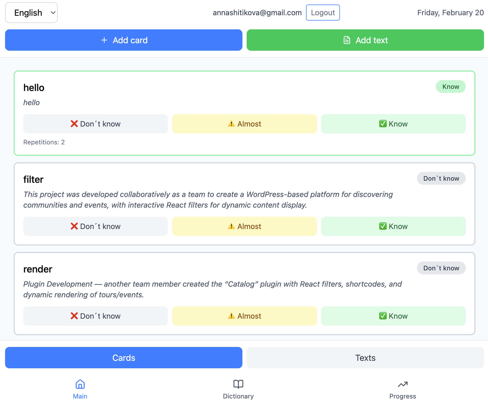
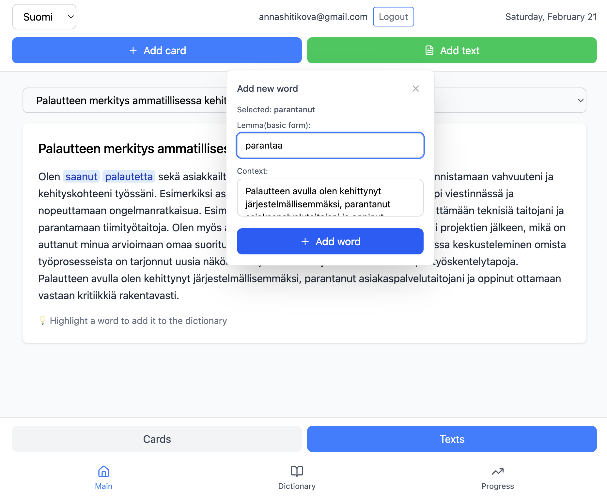
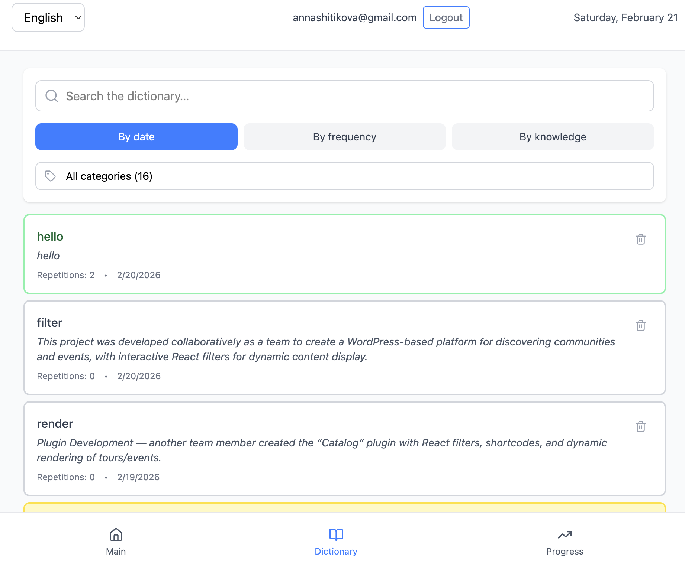
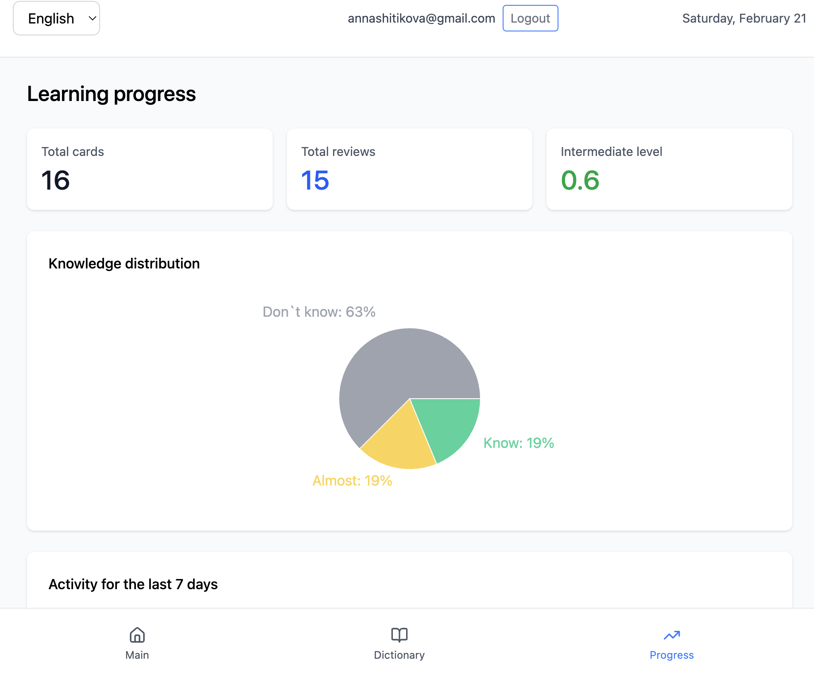

# 📘 Language Learning App

A lightweight app for learning vocabulary from real texts.  
Select a word → add a flashcard with context → track learning progress.

## 🛠 Tech Stack

<p>
  
  
  
  
  
  
</p>

<p>
  
  
  
  
  
  
</p>

<p>
  
  
  
</p>

- **Frontend**: React, Vite, Tailwind CSS, TypeScript
- **Backend**: Express, Supabase (Postgres), TypeScript
- **AI / Voice**:

  - Browser Web Speech API (`SpeechRecognition` / `webkitSpeechRecognition`)
  - Google Gemini via `@google/generative-ai`

- **Other**: Recharts, lucide-react, Axios

---

## 📸 Screenshots / App Preview / [🌐 Live Demo](https://typescriptfs9-1.onrender.com/)

| Main (Cards List)                                                            | Add New Word (From Text)                                                           | Dictionary                                                                  | Progress                                                                    |
| ---------------------------------------------------------------------------- | ---------------------------------------------------------------------------------- | --------------------------------------------------------------------------- | --------------------------------------------------------------------------- |
|  |  |  |  |

---

## ✨ Key Features

- Select words directly in text
- One-click flashcard creation with context
- AI-powered voice input for flashcard creation
- Speech-to-text support in the Add Card modal
- Gemini-based parsing of spoken input into structured flashcards
- Highlight known words in reading mode
- 3-level knowledge rating
- Visual progress (charts & colors)
- Edit & manage cards and contexts
- Google OAuth for user authentication
- Backend sync with Supabase (Postgres)

---

## 🧠 Architecture Overview

### Frontend

- **App.tsx**: Manages global state, user session, and API calls
- **AddCardModal**:
  - Manual flashcard creation
  - Voice input button (mic)
  - AI-assisted autofill for word + context
- useVoiceInput.ts:
  - Wraps browser speech recognition
  - Handles listening state, transcript, and microphone errors
- voiceService.ts:
  - Sends authenticated requests to /api/voice
- **TextReader**: Word selection, context extraction, and vocabulary highlighting
- **Dictionary / Cards**: Flashcard management and inline editing
- **Progress**: Learning statistics and spaced repetition tracking

### 🎤 AI Voice Support

(Currently supports learning in **English** and **Finnish**)

The app now supports **voice-based flashcard creation**:

- Tap the **microphone icon** in the **Add Card** modal
- Speak a word or phrase (optionally in context)
- Browser **SpeechRecognition** converts speech to text
- The frontend sends the transcript to the backend
- The backend uses **Google Gemini (`gemini-2.5-flash`)** to extract:
  - `word`
  - `context`
- The form is auto-filled so the user can quickly save the card

### Example

**Voice input:**
**AI output:**

> “Serendipity. I found this book by pure serendipity.”

```
{
  "word": "Serendipity",
  "context": "I found this book by pure serendipity."
}
```

### Note

Voice recognition works best in **Chrome / Chromium-based browsers**.  
Since speech-to-text relies on the browser’s native recognition engine, **Finnish transcription can sometimes be less accurate than English**, especially for short words or unclear pronunciation.  
If the AI extracts the wrong word or context, users can quickly edit the fields before saving the flashcard.

### Backend

- **Stack**: Express + Supabase (Postgres)
- **Auth**: Google OAuth via Supabase; backend validates JWT with middleware (`checkAuth`)
- **Routes**:
  - `GET /api/protected` — validate token
  - `GET/POST/PUT/DELETE /api/texts` — manage user texts
  - `GET/POST/DELETE/PATCH /api/flashcards` — manage flashcards
  - `POST /api/flashcards/:id/knowledge` — update learning level
  - `POST /api/flashcards/:id/contexts` — add context to flashcard
  - `POST /api/voice` — parse voice transcript into { word, context } using AI
- **Data Model**:
  - `texts`:
    - `id` (UUID, primary key)
    - `user_id` (UUID, references `auth.users`)
    - `title` (text, not null)
    - `content` (text, not null)
    - `language` (text, default 'en')
    - `created_at` (timestamp, default now)
  - `flashcards`:
    - `id` (UUID, primary key)
    - `user_id` (UUID, references `auth.users`)
    - `word` (text, not null)
    - `translation` (text)
    - `notes` (text)
    - `lemma` (text, default '')
    - `category` (text)
    - `language` (text, default 'en')
    - `created_at` (timestamp, default now)
  - `contexts`:
    - `id` (UUID, primary key)
    - `flashcard_id` (UUID, references `flashcards`)
    - `text_id` (UUID, references `texts`, nullable)
    - `sentence` (text, not null)
    - `created_at` (timestamp, default now)
  - `learning_progress`:
    - `id` (UUID, primary key)
    - `flashcard_id` (UUID, references `flashcards`)
    - `user_id` (UUID, references `auth.users`)
    - `level` (int, default 0) — 0 = new, 1 = learning, 2 = known
    - `repetitions` (int, default 0)
    - `last_reviewed` (timestamp)
    - `next_review` (timestamp)
    - `created_at` (timestamp, default now)

---

## 📚 What This Project Demonstrates

- Seamless integration of frontend and backend
- Strong UX focus with dynamic forms and inline editing
- Google OAuth for secure authentication
- AI-assisted voice workflows for faster data entry
- Browser speech recognition + backend LLM orchestration
- Scalable architecture with Supabase for data persistence
- Clean and modular React component structure

---

## 🚀 Future Enhancements

- Full i18n support (UI translation)
- Advanced spaced repetition algorithm
- Accessibility improvements
- Mobile-first design optimization
- Enhanced analytics and progress tracking
- Optional text-to-speech pronunciation playback

---

### [🌐 Live Demo](https://typescriptfs9-1.onrender.com/)
